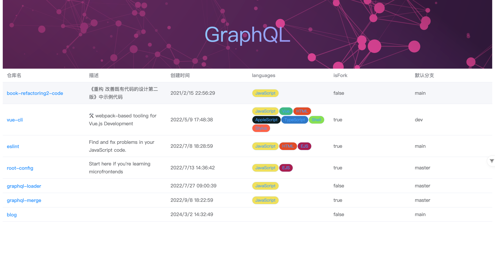

# vue 中集成 graphql

1.  初始化 graphql web client，管理 graphql 请求\
    \
    ApolloClient 是一个 JavaScript 工具，提供数据缓存、错误处理等功能，帮助我们在前端应用中管理 graphql 请求。\
    提供 graphql 服务地址信息和请求头信息，实例化一个 apollo client\


    ```javascript
    import { ApolloClient, InMemoryCache } from '@apollo/client/core'

    const cache = new InMemoryCache()
    // 填入申请的 github token
    const token =
      'TOKEN github_token'
    // 初始化 graphql web client
    const client = new ApolloClient({
      cache: cache,
      uri: '/graphql',
      queryDeduplication: false,
      headers: {
        Authorization: token
      },
      defaultOptions: {
        watchQuery: {
          fetchPolicy: 'cache-and-network'
        }
      }
    })
    export default client
    ```


2.  提供 graphql schema\
    在 vue 中直接写 gql 代码会报错，需要在 vite.config.js 配置 [`vite-plugin-graphql-loader`](https://github.com/0x31/vite-plugin-graphql-loader) 解析 gql 文件，将原生 gql 代码解析成 JS 可执行代码\


    ```javascript
    // vite.config.js
    import graphqlLoader from 'vite-plugin-graphql-loader'

    export default defineConfig({
      plugins: [vue(), graphqlLoader()]
    })
    ```

    \
    配置完成后，就可以在源码中编写 gql 文件了，下面提供了一个查找用户仓库信息的 query 语句\


    ```graphql
    # respository.gql
    fragment respository on Repository {
      id
      name
      description
      createdAt
      url
      sshUrl
      isPrivate
      isFork
      languages(last: $last) {
        nodes {
          id
          color
          name
        }
      }
      defaultBranchRef {
        name
      }
    }
    ```


    ```graphql
    #import "./respository.gql"

    query ($login: String!, $last: Int!) {
      user(login: $login) {
        repositories(last: $last) {
          nodes {
            ...respository
          }
          totalCount
        }
      }
    }
    ```


由于这里引入了 graphql 源码文件，配置 IDE 代码高亮和代码格式化是不可或缺的

1. 安装 vscode graphql 插件高亮代码
2.  配置 @graphql-eslint/eslint-plugin  eslint 插件实现错误校验和代码格式化功能\


    ```javascript
    {
      overrides: [
        {
          files: ['*.graphql'],
          parser: '@graphql-eslint/eslint-plugin',
          plugins: ['@graphql-eslint']
        }
      ]
    }
    ```


3.  发送请求\
    步骤 1 准备好了发送请求的 client，步骤 2 提供了查询语句，现在可以调用 `client.query`方法发送请求查询数据了\


    ```javascript
    <script setup>
    import { ref } from 'vue'
    import gqlClient from '@/services/gql'
    import userSchema from './user.gql'

    const repositories = ref([])
    const getUserInfo = async () => {
      // 请求参数
      const variables = {
        login: 'xxx', // github 用户名
        last: 7
      }
      // 发送请求
      const { data } = await gqlClient.query({ query: userSchema, variables })
      return data.user
    }
    getUserInfo().then((data) => {
      repositories.value = data.repositories.nodes
    })
    </script>
    ```

    \
    拿到了 repositories 数据后渲染成表格展示仓库信息，UI 如下所示：\


    <figure><figcaption></figcaption></figure>
