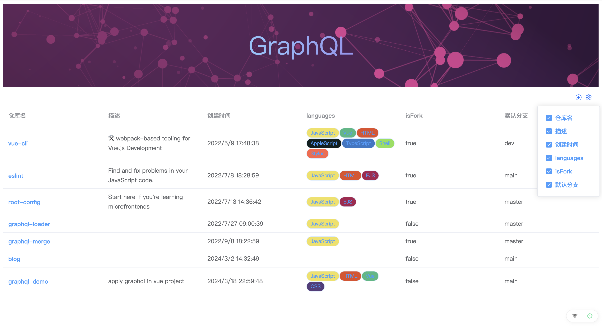

# 裁切与合并

## 裁切

### 场景

一个表格展示的列过多时，表格列信息无法完全展示，用户可能只关注部分列的信息，表格提供自定义列功能，支持控制表格列的显隐。

<figure><figcaption></figcaption></figure>

更改表格列的显隐后，需要重新刷新表格数据。如果是 restful 接口，接口字段不会改变每次加载数据都会加载所有表格列的数据；而使用 graphql 接口的话，其设计原则之一就是无冗余的按需加载所需数据，更改表格列显隐后，只需要加载显示的列的数据，所以需要提供裁切功能当表格列变化时提供每次查询的 query 语句。

查询语句

```graphql
query user($login: String!, $last: Int!) {
  user(login: $login) {
    repositories(last: $last) {
      totalCount
      nodes {
        id
        name
        description
        createdAt
        url
        isFork
        languages(last: $last) {
          nodes {
            id
            color
            name
          }
        }
        defaultBranchRef {
          name
        }
      }
    }
  }
}
```

只显示仓库名后的查询语句

```graphql
query user($login: String!, $last: Int!) {
  user(login: $login) {
    repositories(last: $last) {
      totalCount
      nodes {
        id
        name
        url
      }
    }
  }
}
```

### 设计

裁切功能的目标是根据表格列按需裁切 query 语句。表格列如何和 query 语句产生关联呢？

query 语句中的每个字段都对应着一个确定的路径，如`name`的路径是`user.repositories.nodes.name`,列名都会指定`prop`标识数据来源，只需要让`prop`和路径建立映射关系，就可以通过路径按需裁切出 query 语句。

1.  列名和 query 语句中的字段路径建立映射关系\


    ```javascript
    {
      total: 'user.repositories.totalCount'
      id: 'user.repositories.nodes.id',
      name: 'user.repositories.nodes.name',
      url: 'user.repositories.nodes.url',
    };
    ```


2.  `id` 和 `total` 数据并不属于需要展示的列，但是确是必须存在的数据，提供 columns 配置项筛选出显示的表格列， columns 的内容应该是表格列的全集\


    ```javascript
    {
      total: 'user.repositories.totalCount'
      id: 'user.repositories.nodes.id',
      columns: {
        name: 'user.repositories.nodes.name',
        url: 'user.repositories.nodes.url',
      },
    };
    ```


3.  路径过于冗长，有没有简写的方式？由于 graphql 提供了 fragment 进行片段复用，可以使用 fragment 名称简写路径，缩短路径长度\
    \
    query 语句\


    ```graphql
    fragment repository on Repository {
      id
      name
      description
    }

    query user($login: String!, $last: Int!) {
      user(login: $login) {
        repositories(last: $last) {
          totalCount
          nodes {
            ...repository
          }
        }
      }
    }
    ```

    \
    简写路径\
    `user.repositories.nodes`路径可以直接使用 fragment 名称 `repository` 代替\


    <pre class="language-javascript"><code class="lang-javascript">{
    <strong>  total: 'user.repositories.totalCount'
    </strong>  id: 'repository.id',
      columns: {
        name: 'repository.name',
        url: 'repository.url',
      },
    };
    </code></pre>


多个同名 fragment 复用时，简写路径只会裁切第一次使用 fragment 的语句，其余同名 fragment 的字段需要使用完整路径


4.  拍平数据；路径除了作为裁切功能的依据，也可以用来获取响应中字段数据；约定字段数据是数组数据时解析为 list 属性下的对象数组\
    \
    响应数据\


    ```javascript
    {
      user: {
        totalCount: 10,
        repositories: {
          nodes: [
            {
              id: 'R_kgDOHTg3yg',
              name: 'vue-cli',
              url: 'https://github.com/keywordwei/vue-cli',
            },
            {
              id: 'R_kgDOHoJKyA',
              name: 'eslint',
              url: 'https://github.com/keywordwei/eslint',
            },
          ],
        },
      },
    }
    ```

    \
    根据列名路径映射关系拍平后的数据\


    ```javascript
    {
      total: 10,
      list: [
        {
          id: 'R_kgDOHTg3yg',
          name: 'vue-cli',
          url: 'https://github.com/keywordwei/vue-cli',
        },
        {
          id: 'R_kgDOHoJKyA',
          name: 'eslint',
          url: 'https://github.com/keywordwei/eslint',
        },
      ],
    };
    ```

### 合并

## 场景

### 实现
